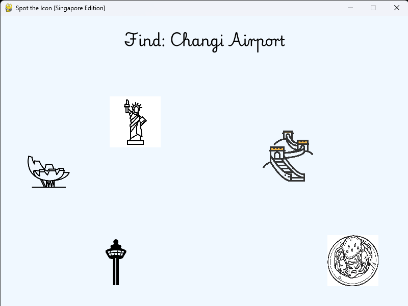
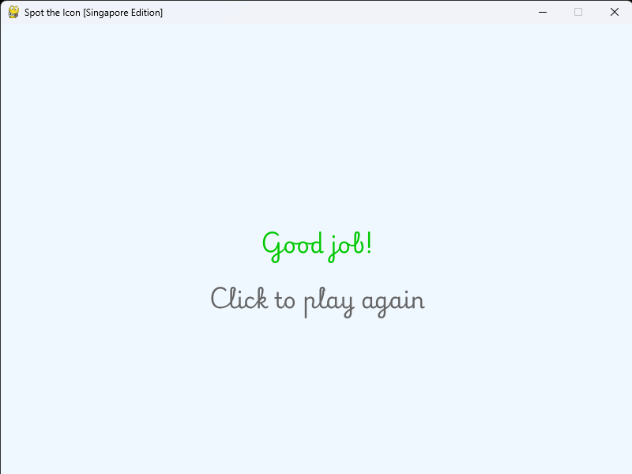

# 🧠 Spot the Icon [Singapore Edition]

A fun, dementia-friendly bubble-popping memory game built using **Python** and **Pygame**. Players must click the correct floating icon that matches the target word shown!

---

## 🕹️ Gameplay

- Icons (images) float around the screen randomly.
- At the top, a word is displayed — e.g., “Merlion”.
- Identify and select the correct image.
- Feedback is given immediately (“Good job!” / “Try again!”).

---

## 📷 Preview

<table>
  <tr>
    <td></td>
    <td></td>
    <td></td>
  </tr>
</table>

---

## 📦 Requirements

All dependencies are listed in `requirements.txt`. To install:

```bash
pip install -r requirements.txt
````

Main dependencies:

* `pygame`

---

## 🚀 How to Run

```bash
python bubble_pop.py
```

---

## 📁 Project Structure

```
dementia_bubble_pop/
├── assets/                 # Images, fonts, icons
│   ├── Playwrite.ttf       # Custom font
│   └── [icon images].png
├── bubble_pop.py           # Main game logic
├── requirements.txt        # Python dependencies
└── README.md               # This file
```

---

## 💡 Features

* Clean UI with custom font
* Floating icon animation
* Randomized target word
* Click detection and feedback
* Designed to be intuitive for seniors
