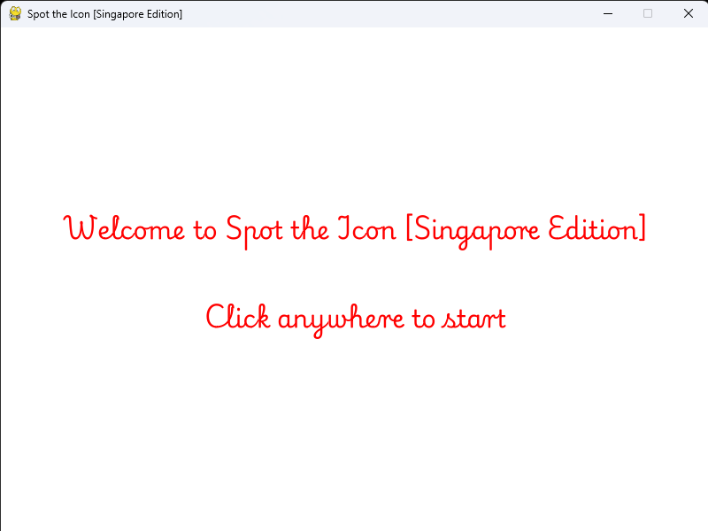

# 🧠 Spot the Icon [Singapore Edition]

A fun, dementia-friendly icon-spotting memory game built using **Python** and **Pygame**. Players must click the correct floating icon that matches the target word shown!

---

## 🕹️ Gameplay

- Icons (images) float around the screen randomly.
- At the top, a word is displayed — e.g., “Merlion”.
- Identify and select the correct image.
- Feedback is given immediately (“Good job!” / “Try again!”).

---

## 📷 Preview

<table>
  <tr>
    <td></td>
    <td></td>
    <td></td>
  </tr>
</table>

---

## 📦 Setup

### ✅ 1. Clone this repository

Open your terminal (Command Prompt / PowerShell / Terminal) and run:

```bash
git clone https://github.com/lucyy05/01.020_DTP_III.git
```

Then move into the project folder:

```bash
cd 01.020_DTP_III
```

---

### ✅ 2. Set up a virtual environment (optional but recommended)

```bash
python -m venv venv
```

Activate the virtual environment:

* On **Windows**:

```bash
venv\Scripts\activate
```

* On **Mac/Linux**:

```bash
source venv/bin/activate
```

---

### ✅ 3. Install the required Python packages

```bash
pip install -r requirements.txt
```

---

### ✅ 4. Run the game 🎮

```bash
python spot_icon.py
```

---

## 📁 Project Structure

```
01.020_DTP_III/
│
├── assets/                 # Game assets
│   ├── Playwrite.ttf       # Custom font
│   └── [icon images].png   # All icon images used in-game
│
├── media/                  # Screenshots for README or documentation
│   ├── start.png
│   ├── gameplay.png
│   └── end.png
│
├── spot_icon.py            # Main game logic and entry point
├── requirements.txt        # Python dependencies
├── README.md               # Project overview and instructions
└── .gitignore              # Files/folders Git should ignore
```

---

## 💡 Features

* Clean UI with custom font
* Floating icon animation
* Randomized target word
* Click detection and feedback
* Designed to be intuitive for seniors
